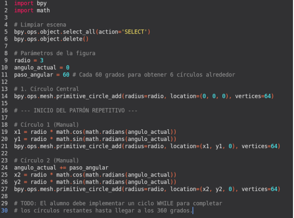
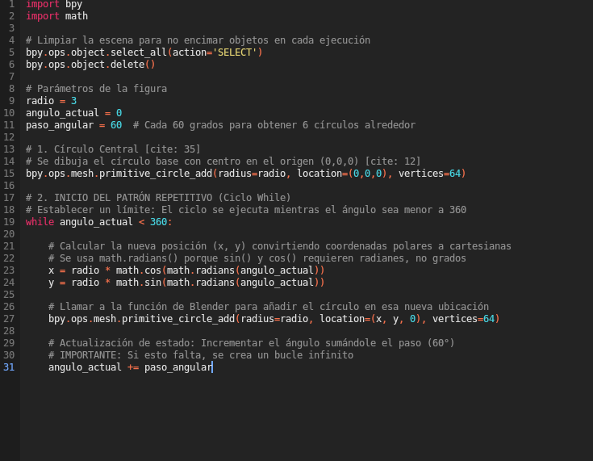
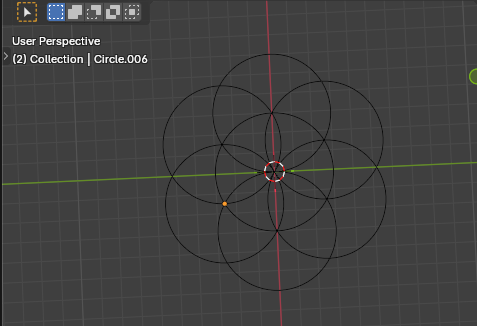
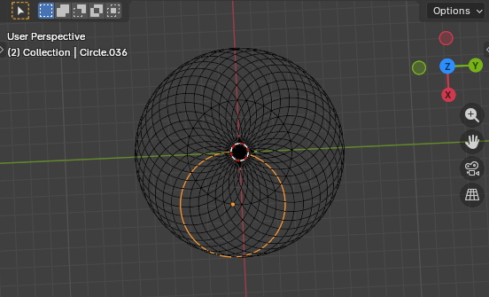

# Practica-flor
Practica en blender del dibujo de la flor de la vida

Para esta practica haremos una flor de la vida con 6 circulos, para ello tenemos ya el codigo entregado por el profesor, solamente faltaria crear un ciclo while para no tener que repetir el mismo codigo 6 veces. El codigo es el siguiente:


### Resultados


## Ciclo while
Teniendo esto en cuenta introduciremos un ciclo "while" dentro del codigo para hacer los circulos


## Resultados finales
Este seria el resultado de la flor de loto con las 6 caras


## Resultados alternativos
Si queremos que nuestra flor de vida tenga mas circulos, debemos de disminuir el paso angular, el paso angular lo que nos permite es ir creando circulos cada cierto numero de grados, mientras menores sean los grados (recomendable que el valor que le pongamos al paso angular tenga modulo 0 al dividir 360/paso angular). Ejemplo para una flor de la vida con 36 circulos:
```python
# Parámetros de la figura 
radio = 3 
angulo_actual = 0
paso_angular = 10  # Cada 10 grados para obtener 36 círculos alrededor
```

